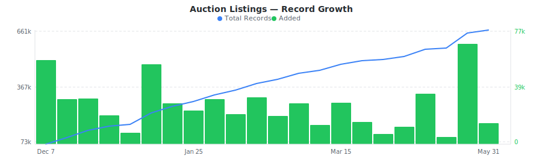

# IAAI Insurance Auto Auction Dataset

&nbsp;&nbsp;[](https://rebrowser.net/products/datasets/iaai)

Daily sample of IAAI insurance auto auction lots with damage assessments, title status, bidding data, and branch locations across North America.


This repository contains a preview sample of the [IAAI dataset](https://rebrowser.net/products/datasets/iaai) published by Rebrowser. If you're doing academic research, you may be eligible for free access to a much larger slice — see [Free Datasets for Research](https://rebrowser.net/free-datasets-for-research).


This dataset contains **1** entity, each in its own folder: Auction Listings (`auction-listings`). See below for a full field breakdown, sample counts, and data distributions for each.

*Found this useful? ⭐ Star this repo to help us keep publishing fresh data. Found an error? [Let us know](https://rebrowser.net/contact-us).*


---

### Auction Listings
IAAI insurance auto auction lots with vehicle specs, damage classifications, loss types, title status, mileage, drivetrain, branch locations, and auction scheduling.


> **869,261** total records from 2025-11-16 to 2026-07-12, **up to 30,000** rows in this sample (3.5% of full dataset).
> Exported as one file per day, up to 1,000 rows each, last 30 days retained.



| Field | Type | Fill Rate | Description |
| --- | --- | --- | --- |
| `_primaryKey` | `string` | 100% | Unique identifier for this record |
| `_firstSeenAt` | `datetime` | 100% | First time this record was seen |
| `_lastSeenAt` | `datetime` | 100% | Last time this record was updated |
| `stockNumber` | `string` | 100% | Unique IAA stock number (auction identifier) |
| `itemId` | `string` | 100% | IAA item ID for the auction listing |
| `salvageId` | `string` | 100% | IAA salvage ID (used in image URLs) |
| `auctionId` | `string` | 100% | IAA auction ID |
| `vin` 🔒 | `string` | 100% | Vehicle Identification Number |
| `vinStatus` | `string` | 100% | VIN validation status (OK, Missing, Damaged, Retagged, Altered) - fraud indicator |
| `year` | `float` | 100% | Vehicle model year |
| `make` | `string` | 100% | Vehicle manufacturer (e.g., CHEVROLET, TOYOTA) |
| `model` | `string` | 100% | Vehicle model name (e.g., SILVERADO 1500, CAMRY) |
| `series` | `string` | 90% | Vehicle series/trim (e.g., LTZ, SE, LS) |
| `bodyStyle` | `string` | 100% | Body style (SEDAN, EXTENDED CAB, SUV, COUPE, etc.) |
| `exteriorColor` | `string` | 100% | Exterior color (WHITE, BLACK, GRAY, etc.) |
| `vehicleType` | `string` | 100% | Inventory type (AUTOMOBILE, MOTORCYCLE, etc.) |
| `vehicleCategory` | `string` | 100% | Inventory category (VEHICLE, EQUIPMENT, etc.) |
| `vehicleClass` | `string` | 100% | Vehicle class (Sedan, Truck, SUV, Coupe, etc.) |
| `inventoryStatus` | `string` | 100% | Inventory status code (RS = Ready for Sale) |
| `interiorColor` | `string` | 20% | Interior color |
| `engine` | `string` | 100% | Engine description (e.g., "5.3L V-8 285HP") |
| `cylinders` | `float` | 98% | Number of engine cylinders |
| `transmission` | `string` | 100% | Transmission type (Automatic, Manual, Unknown) |
| `drivetrain` | `string` | 100% | Drivetrain type (FWD, RWD, 4x4, AWD) |
| `fuelType` | `string` | 100% | Fuel type (Gasoline, Diesel, Electric, Hybrid, FlexibleFuel) |
| `hybridIndicator` | `bool` | 100% | Whether vehicle is a hybrid |
| `primaryDamage` | `string` | 100% | Primary damage (FRONT END, REAR, LEFT SIDE, etc.) |
| `primaryDamageCode` | `string` | 100% | Primary damage code (F, R, LF, RF, etc.) |
| `secondaryDamage` | `string` | 52% | Secondary damage description |
| `secondaryDamageCode` | `string` | 52% | Secondary damage code |
| `lossType` | `string` | 100% | Loss type (Collision, Theft, Fire, Water, Other) |
| `lossTypeCode` | `string` | 100% | Loss type code (0=Collision, 1=Fire, 2=Other, 3=Theft, 4=Water) |
| `titleType` | `string` | 100% | Title document type (BillOfSale, Certificate, etc.) |
| `titleCode` | `string` | 100% | Title code (SAL=Salvage, CLR=Clear, ORG=Original, BOS=Bill of Sale, NRP=Non-Repairable, JNK=Junk) |
| `titleBrand` | `string` | 12% | Title brand (REBUILT, REPAIRABLE, REPOSSESSED, etc.) |
| `titleState` | `string` | 100% | State where title is held (e.g., TX, CA, FL) |
| `titleNotes` | `string` | 12% | Additional title notes/conditions |
| `tboIndicator` | `bool` | 100% | Title Buyer Only - requires special buyer license |
| `hasKeys` | `bool` | 100% | Whether keys are present |
| `runAndDrive` | `bool` | 100% | Whether vehicle runs and drives - critical for buyers |
| `startsDesc` | `string` | 100% | Start condition (Starts, Stationary) |
| `mileage` | `float` | 96% | Odometer reading in miles |
| `odometerBrand` | `string` | 100% | Odometer status (ACTUAL, NOT ACTUAL, NOT REQUIRED/EXEMPT, EXCEEDS MECHANICAL LIMITS, MISSING) |
| `odometerUnit` | `string` | 100% | Odometer unit of measure (mi, km) |
| `airbagState` | `string` | 100% | Airbag condition (Intact, Deployed, Missing, None) |
| `vehicleGrade` | `float` | 95% | Vehicle condition grade (0-100 scale) |
| `vehicleCondition` | `string` | 20% | Overall condition (Complete, Partially Dismantled, Body Only, Frame Only) |
| `catalyticConverter` | `string` | 100% | Catalytic converter status (Present, Missing) - theft indicator |
| `battery` | `string` | 20% | Battery status (Present, Missing, etc.) |
| `radiator` | `string` | 20% | Radiator status (Present, Missing, Damaged) |
| `crExists` | `bool` | 100% | Whether condition report exists |
| `buyNowPrice` 🔒 | `float` | 100% | Buy Now price in USD |
| `minimumBidAmount` 🔒 | `float` | 100% | Minimum bid amount in USD |
| `estimatedRepairCost` 🔒 | `float` | 100% | Estimated repair cost in USD |
| `auctionDateTime` | `datetime` | 100% | Scheduled auction date and time |
| `timedAuctionIndicator` | `bool` | 100% | Whether this is a timed/online auction |
| `buyNowIndicator` | `bool` | 100% | Whether Buy Now is available |
| `currencyCode` | `string` | 100% | Currency code for prices (USD, CAD, etc.) |
| `branchNumber` | `string` | 100% | IAA branch/facility number |
| `branchName` | `string` | 100% | IAA branch/facility name (e.g., "Salt Lake City (UT)") |
| `branchState` | `string` | 100% | Branch state code |
| `branchLink` | `string` | 100% | Branch link identifier (e.g., "342~US") |
| `locationName` | `string` | 100% | Storage location name |
| `locationAddress` | `string` | 100% | Storage location street address |
| `locationCity` | `string` | 100% | Storage location city |
| `locationState` | `string` | 100% | Storage location state |
| `locationZip` | `string` | 100% | Storage location ZIP code |
| `locationPhone` | `string` | 100% | Storage location phone number |
| `locationLatitude` | `float` | 100% | Storage location latitude (for shipping cost calculations) |
| `locationLongitude` | `float` | 100% | Storage location longitude (for shipping cost calculations) |
| `isOffsite` | `bool` | 100% | Whether vehicle is stored offsite |
| `aisle` | `string` | 96% | Storage aisle location |
| `stall` | `string` | 96% | Storage stall number |
| `sellerName` 🔒 | `string` | 89% | Seller/provider name |
| `providerType` | `string` | 100% | Provider type (INS=Insurance, RCC=Remarketing, DLR=Dealer, COR=Corporate, SDS=Specialty, SAL=Salvage, ADJ=Adjuster, GOV=Government, FIN=Finance) |
| `origin` | `string` | 100% | Vehicle origin (Insurance, Repossession, Remarketing Vehicles, Donation, IAA Purchase, Lease/Rental) |
| `countryOfOrigin` | `string` | 100% | Country where vehicle was manufactured |
| `whoCanBuy` | `string` | 79% | Buyer type codes (DEA=Dealer, DIS=Dismantler, EXP=Exporter, REB=Rebuilder, PUB=Public, etc.) |
| `catIndicator` | `bool` | 100% | Catastrophe/flood vehicle indicator - important disclosure |
| `imageUrl` 🔒 | `string` | 96% | Main image URL |
| `image360Url` 🔒 | `string` | 70% | 360-degree view URL |
| `updatedAt` | `datetime` | 100% | Timestamp when IAA last updated the listing |
| `listingUrl` 🔒 | `string` | 100% | Full URL to the IAA vehicle listing page |


> 🔒 **Premium fields** are included in the data files but their values are replaced with `[PREMIUM]`. To access real values, [use our website](https://rebrowser.net/products/datasets/iaai).


#### Field Distributions


<details>
<summary><strong>Loss Type Distribution</strong> (<code>lossType</code>)</summary>


| Value | Count | Share |
| --- | --- | --- |
| Collision | 581,400 | `█████████████░░░░░░░` 66.9% |
| Other | 264,313 | `██████░░░░░░░░░░░░░░` 30.4% |
| Theft | 12,692 | `░░░░░░░░░░░░░░░░░░░░` 1.5% |
| Fire | 6,782 | `░░░░░░░░░░░░░░░░░░░░` 0.8% |
| Water | 4,074 | `░░░░░░░░░░░░░░░░░░░░` 0.5% |

</details>


<details>
<summary><strong>Primary Damage Location</strong> (<code>primaryDamage</code>)</summary>


| Value | Count | Share |
| --- | --- | --- |
| FRONT END | 288,667 | `████████░░░░░░░░░░░░` 38.1% |
| NORMAL WEAR & TEAR | 100,627 | `███░░░░░░░░░░░░░░░░░` 13.3% |
| REAR | 74,474 | `██░░░░░░░░░░░░░░░░░░` 9.8% |
| LEFT SIDE | 58,035 | `██░░░░░░░░░░░░░░░░░░` 7.7% |
| RIGHT SIDE | 54,651 | `█░░░░░░░░░░░░░░░░░░░` 7.2% |
| RIGHT FRONT | 47,776 | `█░░░░░░░░░░░░░░░░░░░` 6.3% |
| LEFT FRONT | 47,269 | `█░░░░░░░░░░░░░░░░░░░` 6.2% |
| FRONT & REAR | 41,039 | `█░░░░░░░░░░░░░░░░░░░` 5.4% |
| UNKNOWN | 23,785 | `█░░░░░░░░░░░░░░░░░░░` 3.1% |
| LEFT REAR | 21,791 | `█░░░░░░░░░░░░░░░░░░░` 2.9% |

</details>


<details>
<summary><strong>Vehicle Class Distribution</strong> (<code>vehicleClass</code>)</summary>


| Value | Count | Share |
| --- | --- | --- |
| Sedan | 451,278 | `███████████░░░░░░░░░` 53.5% |
| Truck | 129,641 | `███░░░░░░░░░░░░░░░░░` 15.4% |
| SUV/Crossover | 117,393 | `███░░░░░░░░░░░░░░░░░` 13.9% |
| Hatchback | 50,387 | `█░░░░░░░░░░░░░░░░░░░` 6.0% |
| Coupe | 32,717 | `█░░░░░░░░░░░░░░░░░░░` 3.9% |
| SUV | 15,804 | `░░░░░░░░░░░░░░░░░░░░` 1.9% |
| Sedan/Hatchback | 15,416 | `░░░░░░░░░░░░░░░░░░░░` 1.8% |
| Minivan | 11,120 | `░░░░░░░░░░░░░░░░░░░░` 1.3% |
| Convertible | 10,228 | `░░░░░░░░░░░░░░░░░░░░` 1.2% |
| Hatchback/Crossover | 8,853 | `░░░░░░░░░░░░░░░░░░░░` 1.1% |

</details>


<details>
<summary><strong>Title Code Distribution</strong> (<code>titleCode</code>)</summary>


| Value | Count | Share |
| --- | --- | --- |
| SAL | 342,844 | `████████░░░░░░░░░░░░` 39.4% |
| OTH | 289,916 | `███████░░░░░░░░░░░░░` 33.4% |
| CLR | 160,690 | `████░░░░░░░░░░░░░░░░` 18.5% |
| ORG | 53,117 | `█░░░░░░░░░░░░░░░░░░░` 6.1% |
| BOS | 17,831 | `░░░░░░░░░░░░░░░░░░░░` 2.1% |
| NRP | 3,187 | `░░░░░░░░░░░░░░░░░░░░` 0.4% |
| JNK | 1,676 | `░░░░░░░░░░░░░░░░░░░░` 0.2% |

</details>


<details>
<summary><strong>Vehicle Origin</strong> (<code>origin</code>)</summary>


| Value | Count | Share |
| --- | --- | --- |
| Insurance | 643,619 | `███████████████░░░░░` 74.0% |
| Remarketing Vehicles | 157,292 | `████░░░░░░░░░░░░░░░░` 18.1% |
| Repossession | 34,166 | `█░░░░░░░░░░░░░░░░░░░` 3.9% |
| Donation | 21,801 | `█░░░░░░░░░░░░░░░░░░░` 2.5% |
| IAA Purchase | 6,545 | `░░░░░░░░░░░░░░░░░░░░` 0.8% |
| Lease/Rental | 5,730 | `░░░░░░░░░░░░░░░░░░░░` 0.7% |
|   | 108 | `░░░░░░░░░░░░░░░░░░░░` 0.0% |

</details>


<details>
<summary><strong>Listings by Branch State</strong> (<code>branchState</code>)</summary>


| Value | Count | Share |
| --- | --- | --- |
| CA | 105,582 | `████░░░░░░░░░░░░░░░░` 20.8% |
| TX | 100,352 | `████░░░░░░░░░░░░░░░░` 19.8% |
| FL | 44,872 | `██░░░░░░░░░░░░░░░░░░` 8.8% |
| GA | 43,113 | `██░░░░░░░░░░░░░░░░░░` 8.5% |
| NC | 42,799 | `██░░░░░░░░░░░░░░░░░░` 8.4% |
| NY | 41,087 | `██░░░░░░░░░░░░░░░░░░` 8.1% |
| OH | 40,127 | `██░░░░░░░░░░░░░░░░░░` 7.9% |
| IL | 33,646 | `█░░░░░░░░░░░░░░░░░░░` 6.6% |
| VA | 28,370 | `█░░░░░░░░░░░░░░░░░░░` 5.6% |
| PA | 27,940 | `█░░░░░░░░░░░░░░░░░░░` 5.5% |

</details>


---

## Pre-built Views on Rebrowser

Rebrowser web viewer lets you filter, sort, and export any slice of this dataset interactively. These pre-built views are ready to open:


### Auction Listings


[Listings with Buy Now Price](https://rebrowser.net/products/datasets/iaai/auction-listings/views/listings-with-buy-now) — 135,598 records

↳ `[{"field":"buyNowIndicator","op":"isTrue","value":true},{"sort":"buyNowPrice ASC"}]`

[Run and Drive Vehicles](https://rebrowser.net/products/datasets/iaai/auction-listings/views/run-and-drive-vehicles) — 535,770 records

↳ `[{"field":"runAndDrive","op":"isTrue","value":true},{"sort":"_lastSeenAt DESC"}]`

[Collision Total Loss Vehicles](https://rebrowser.net/products/datasets/iaai/auction-listings/views/collision-total-loss) — 529,536 records

↳ `[{"field":"lossType","op":"is","value":"Collision"},{"sort":"_lastSeenAt DESC"}]`

[Theft Recovery Vehicles](https://rebrowser.net/products/datasets/iaai/auction-listings/views/theft-recovery-vehicles) — 11,821 records

↳ `[{"field":"lossType","op":"is","value":"Theft"},{"sort":"_lastSeenAt DESC"}]`

[Insurance Company Listings](https://rebrowser.net/products/datasets/iaai/auction-listings/views/insurance-seller-listings) — 592,597 records

↳ `[{"field":"origin","op":"is","value":"Insurance"},{"sort":"_lastSeenAt DESC"}]`


*[See all 40 views →](https://rebrowser.net/products/datasets/iaai/auction-listings)*


---

## Code Examples

```python
import pandas as pd
from pathlib import Path

# ── Auction Listings ─────────────────────────────────────────────────────────
files = sorted(Path('rebrowser/iaai-dataset/auction-listings/data').glob('*.parquet'))[-7:]
df = pd.concat([pd.read_parquet(f) for f in files])

# Top 10 makes by listing volume
print(df['make'].value_counts().head(10).to_string())

# Average mileage by vehicle class for collision total losses
collision = df[df['lossType'] == 'Collision']
print(collision.groupby('vehicleClass')['mileage'].mean().sort_values().round(0).to_string())

# Loss type distribution across all listings
print(df['lossType'].value_counts().to_string())

# Run-and-drive listings by branch state (top 10 states)
drivable = df[df['runAndDrive'] == True]
print(drivable['branchState'].value_counts().head(10).to_string())

# Title code breakdown for theft recovery vehicles
theft = df[df['lossType'] == 'Theft']
print(theft['titleCode'].value_counts().to_string())
```

---

## Use Cases


### Salvage Valuation Modeling

Build pricing models using loss type, damage location, mileage, title status, and vehicle specs. Compare across branches and states to identify regional price variations.


### Theft Recovery Analysis

Filter by loss type to study theft recovery patterns by make, model, and state. Identify which vehicles are most frequently recovered and their typical condition at auction.


### Inventory Sourcing

Monitor auction listings by vehicle class, drivetrain, and branch location to find inventory matching rebuild or parts sourcing criteria. Track run-and-drive status and key availability.


### Market Trend Research

Track shifts in loss type distribution, vehicle class mix, and geographic auction volume over time. Analyze how catastrophe events and seasonal patterns affect regional supply.


---

## Full Dataset on Rebrowser


This repo is a 1,000-row preview sample. The full dataset is at [rebrowser.net/products/datasets/iaai](https://rebrowser.net/products/datasets/iaai)

Doing academic research? You may qualify for free access to a larger slice. See [Free Datasets for Research](https://rebrowser.net/free-datasets-for-research).

On Rebrowser you can:
- **Filter before you buy** — use the web UI to apply filters on any field and sort by any column. Preview results before purchasing. You only pay for records that match your criteria.
- **Export in your format** — CSV, JSON, JSONL, or Parquet depending on your plan.
- **Access via API** — integrate dataset queries into your pipelines and workflows.
- **Choose your freshness** — plans range from a 14-day lag to real-time data with no delay.
- **Select only the fields you need** — keep exports lean. Premium fields with richer data are available on higher plans.

[Pricing](https://rebrowser.net/pricing) starts at **$2 per 1,000 rows** with volume discounts.

---

## License & Terms

**Free for research and non-commercial use** with attribution. See [license terms](https://rebrowser.net/free-datasets-for-research#license) and [how to cite](https://rebrowser.net/free-datasets-for-research#citation).

```bibtex
@misc{rebrowser_iaai,
  author       = {Rebrowser},
  title        = {IAAI Insurance Auto Auction Dataset},
  year         = {2026},
  howpublished = {\url{https://rebrowser.net/products/datasets/iaai}},
  note         = {Accessed: YYYY-MM-DD}
}
```

Commercial use requires a paid license — see [pricing](https://rebrowser.net/pricing). Use of this data is governed by the [Rebrowser Terms of Use](https://rebrowser.net/terms-of-use), which may be updated at any time independently of this repository.

---

## Disclaimer

Rebrowser is an independent data provider and is not affiliated with, endorsed by, or sponsored by IAAI. Any trademarks are the property of their respective owners. This dataset is compiled from publicly available information; we do not request or collect IAAI user credentials. By using this dataset, you agree to comply with IAAI's Terms of Service and all applicable laws and regulations. Images, logos, descriptions, and other materials included in this dataset remain the intellectual property of their respective owners and are provided solely for informational purposes. Rebrowser makes no warranties regarding the accuracy, completeness, or legality of the data and assumes no liability for how the data is used. You are solely responsible for ensuring that your use of this dataset does not infringe on the rights of any third party.


You can also find this data on [Kaggle](https://www.kaggle.com/datasets/rebrowser/iaai-dataset), [HuggingFace](https://huggingface.co/datasets/rebrowser/iaai-dataset), [Zenodo](https://doi.org/10.5281/zenodo.18854631).


